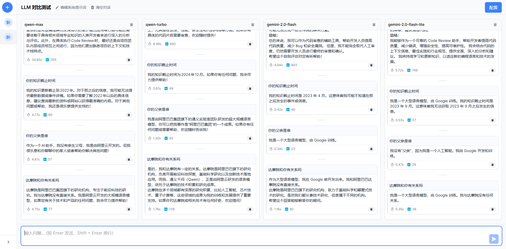
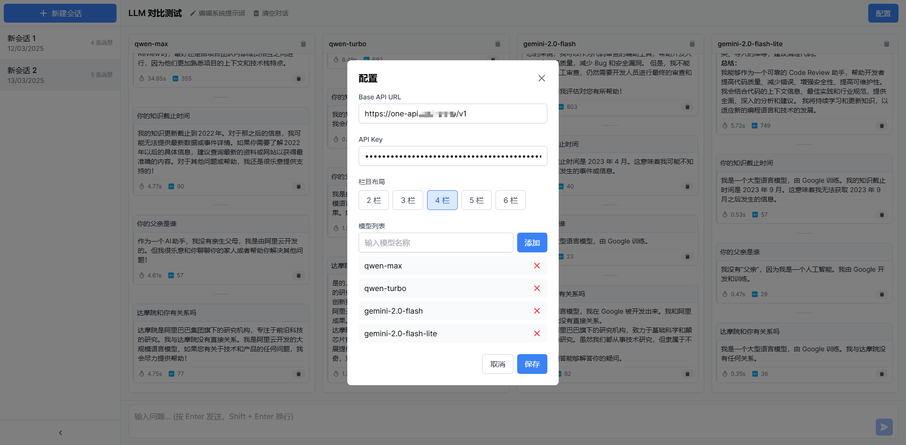
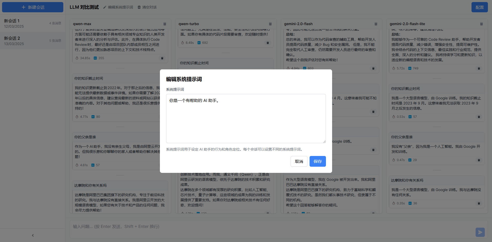

# LLM 对比测试平台 | LLM Compare

> [!IMPORTANT]
> 目前仍然在开发阶段，不保证稳定性。

一个用于比较多个大型语言模型（LLM）性能和响应质量的 React 应用程序。该平台允许用户同时向多个 LLM 发送相同的提示，并在并排视图中比较它们的响应。

> [!TIP]
> 后端 API 请使用这个项目（基于 one-api 项目做了点改动）：https://github.com/PrintNow/one-api
>
> 因为配合本项目做了一些特殊改动，Docker 镜像为：`shine09/one-api:latest`
>
>> 本人对 Go 还不是特别熟悉，所以有哪里改的不好的地方欢迎留言讨论。

| 首页                              | 配置                                  | 系统提示词                                     |
|---------------------------------|-------------------------------------|-------------------------------------------|
|  |  |  |

## 技术栈

- Node >= 18
- React 18
- TypeScript
- Tailwind CSS

## 快速使用

在使用本项目前，你需要了解并熟悉 [one-api](https://github.com/songquanpeng/one-api) 项目的使用，one-api 是 LLM API 管理 &
分发系统，可以统一 LLM 调用入口，方便使用不同平台（如 OpenAI、Grok、Gemini、阿里百炼等）的 LLM。
具体使用方法请看文档：https://github.com/songquanpeng/one-api#%E4%BD%BF%E7%94%A8%E6%96%B9%E6%B3%95

### 方式一、直接运行前端

如果你想直接跑起前端项目，可以直接使用本项目 Docker 镜像：`shine09/llm-composer:latest`

### 方式二、使用 docker-compose

本项目也提供 `docker-compose.yaml` 包含 one-api 和本项目前端，开箱即用：

```shell
# 启动
docker compose up -d

# 查看运行状态
docker compose ps
```

* 前端：http://localhost:3649
* 后端：http://localhost:3000  (需要做出一些配置，初始账号/密码为：`root` / `123456`)

## 功能特性

### 核心功能

- **多模型并行测试**：同时向多个 LLM 发送相同的系统提示语（System Prompt）和用户问题（User Prompt），并比较它们的响应响应结果
- **会话管理**：创建、切换和删除多个会话
- **系统提示词定制**：为每个会话自定义系统提示词
- **性能指标**：显示响应时间和 Token 使用量等关键指标
- **清晰的 UI**：直观的时间线设计，清晰区分不同对话组

### 用户体验

- **悬浮时间显示**：鼠标悬停在消息上时显示发送/响应时间
- **消息序号**：每条消息都有序号，方便引用和定位
- **复制功能**：一键复制所有对话内容
- **清空对话**：快速清除当前会话的所有消息
- **响应状态指示**：加载中、成功和错误状态的视觉反馈

### 技术特性

- **响应时间精确计算**：从 API 响应头获取准确的上游处理时间
- **本地存储**：会话和配置保存在本地，无需登录即可使用
- **自适应布局**：响应式设计，适应不同屏幕尺寸
- **优化的滚动体验**：自定义滚动条和平滑滚动效果

## 自定义开发

### 安装依赖

```bash
npm install
```

### 启动开发服务器

```bash
npm run dev
```

### 构建生产版本

```bash
npm run build
```

## 使用指南

1. **初始配置**：
    - 点击右上角的"配置"按钮
    - 设置 Base API URL 和 API Key
    - 配置要比较的模型列表

2. **创建新会话**：
    - 点击"新建会话"按钮
    - 或在左侧边栏点击"+"图标

3. **自定义系统提示词**：
    - 点击顶部的"编辑系统提示词"按钮
    - 输入自定义的系统提示词
    - 点击保存

4. **发送消息**：
    - 在底部输入框中输入您的提示
    - 点击发送按钮或按 Enter 键

5. **比较响应**：
    - 查看不同模型的响应内容
    - 比较响应时间和 Token 使用量
    - 悬停在消息上可查看详细时间信息

6. **管理会话**：
    - 在左侧边栏切换不同会话
    - 使用"清空对话"按钮清除当前会话的消息
    - 点击会话旁的删除图标删除会话

## 注意事项

- 支持任何兼容 OpenAI API 格式的服务，如 Azure OpenAI、One API 等
- 响应时间计算优先使用 `x-one-api-upstream-time` 响应头

## 贡献

欢迎提交 Pull Request 或创建 Issue 来帮助改进这个项目。

## 许可证

MIT
